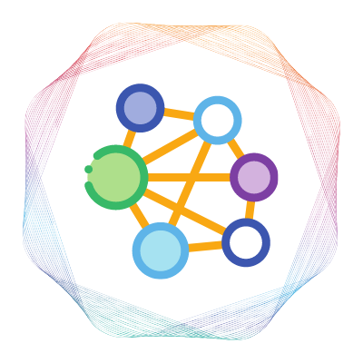
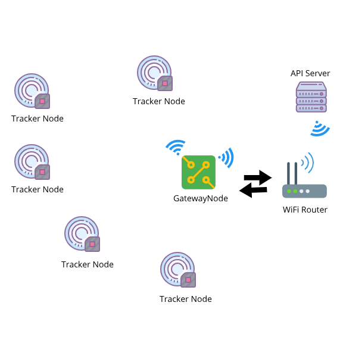

<p align="center">
  <a href="" rel="noopener">
 </a>
</p>

<h3 align="center">Smart Mesh Tracker</h3>

<div align="center">

[]()


</div>

---


<p align="center"> Smart Mesh Tracker
    <br> 
</p>

## 📝 Table of Contents

- [About](#about)
- [Getting Started](#getting_started)
- [Installing](#installing)
- [Mesh Architecture](#circuit)
- [Usage](#usage)
- [Built Using](#built_using)
- [Authors](#authors)


## 🧐 About <a name = "about"></a>

This repo contains circuit, firmware and configuration instructions for Smart Mesh Tracker Projects

## 🏁 Getting Started <a name = "getting_started"></a>

These instructions will get you a copy of the project up and running on your local machine for development and testing purposes. See [deployment](#deployment) for notes on how to deploy the project on a live system.

### Prerequisites

What things you need to install the software and how to install them.

```
- Arduino IDE
```

### Installing <a name = "installing"></a>

A step by step series that tell you how to get the Firmware and Backend running

#### ESP32

You should have Arduino IDE Installed

  1.  Add ESP32 Board to your Arduino IDE
    1. In your Arduino IDE, go to File> Preferences
        Installing ESP32 Add-on in Arduino IDE Windows, Mac OS X, Linux open preferences
    2. Enter ```https://dl.espressif.com/dl/package_esp32_index.json,
                https://raw.githubusercontent.com/espressif/arduino-esp32/gh-pages/package_esp32_index.json``` 
        into the “Additional Board Manager URLs” field then, click the “OK” button:
    Note: if you already have the ESP32 boards URL, you can separate the URLs with a comma as follows:
    ```https://dl.espressif.com/dl/package_esp32_index.json,
       https://raw.githubusercontent.com/espressif/arduino-esp32/gh-pages/package_esp32_index.json,
      http://arduino.esp8266.com/stable/package_esp8266com_index.json```
    1. Open the Boards Manager. Go to Tools > Board > Boards Manager…
    2. Search for ESP32 and press install button for the ESP32 by Espressif Systems“:
    3. That’s it. It should be installed after a few seconds.

  2.  Now copy the contents of the libs folder to the libraries directory of your Arduino
    4. If you are using windows, the libraries directory will be Documents/Arduino/libraries

#### Gateway Node
  1.  Select ESP32 Wrover Module from Tools->Board->ESP32
  2.  Select the correct port from Tools->Port
  3.  Then open MeshGateway.ino file, and open WiFiCreds.h tab on line number 3 and 4, put your WiFi creds
  4.  Upload the Code to your ESP32 Wrover Module Gateway Board


#### Sensor Node
  1.  Select ESP32C3 Dev Module from Tools->Board->ESP32
  2.  Select the correct port from Tools->Port
  3.  Upload the Code to your ESP32C3 Dev Module Sensor Node Board


 

## 🔧 Mesh Architecture <a name = "circuit"></a>

High level architecture of the Mesh network



## 🎈 Usage <a name="usage"></a>

1.  Open APIServerCreds.h tab
2.  Change serverAddress to your desired API End Point.
3.  Add API Headers to header varibale. The headers should be comma separated.
4.  Updated usernameN and passwordN variables to refelct your API authentication scheme.
5.  The HTTP POST requests are made after every 10 seconds, if you want to increase the time, open MeshGateway.ino and on   line number 46 and 193 change 10 to any number of seconds.
6.  Upload the code to the Gateway Node after modifications.
7.  Mesh nodes don't require any modifications. Just upload the mesh node code to the tracker nodes.

## ⛏️ Built Using <a name = "built_using"></a>

- [Arduino](https://www.arduino.cc/) - IDE

## Demo Video
    - [MeshTracker](https://youtu.be/ymA-GVuNWVc) - Mesh Tracker Demo Video

## ✍️ Authors <a name = "authors"></a>

- [@Nauman3S](https://github.com/Nauman3S) - Development and Deployment

